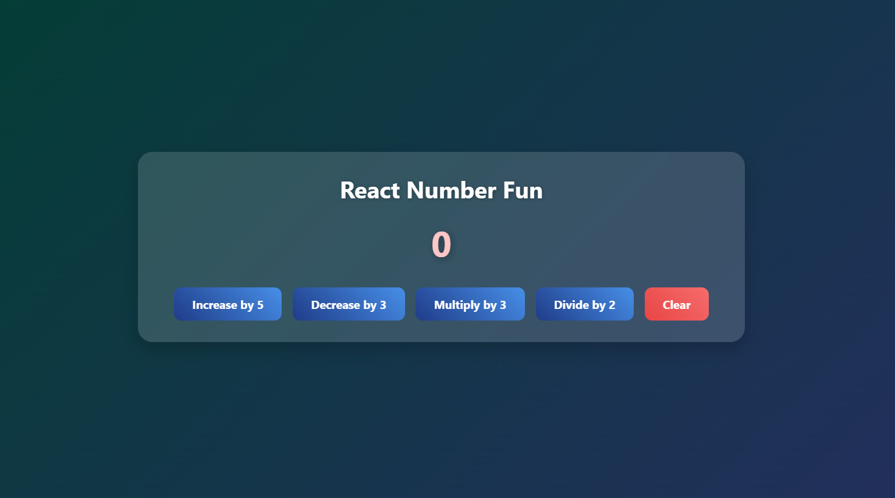

# Interactive Number Calculator

This is a small React project I built while **learning hooks (`useState`)**. It helps practice state management and building a simple interactive UI.

---

## About

The app lets you perform basic arithmetic on a number: increase, decrease, multiply, divide, and reset to zero. It's fully interactive and styled with a modern look using CSS gradients, shadows, and animations.

---

## Features

- **Increase**: Add 5 to the current number  
- **Decrease**: Subtract 3 from the current number  
- **Multiply**: Multiply the number by 3  
- **Divide**: Divide the number by 2  
- **Clear**: Reset the number to 0  
- **Modern UI**: Glass-like container, gradient buttons, hover effects  

